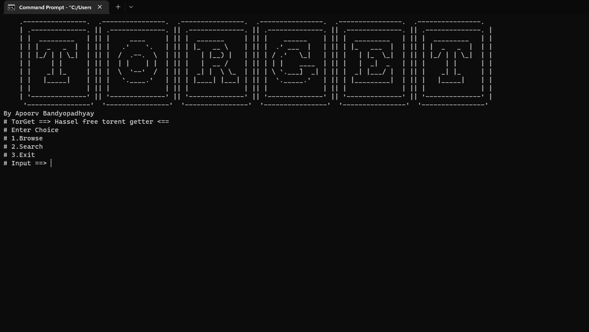
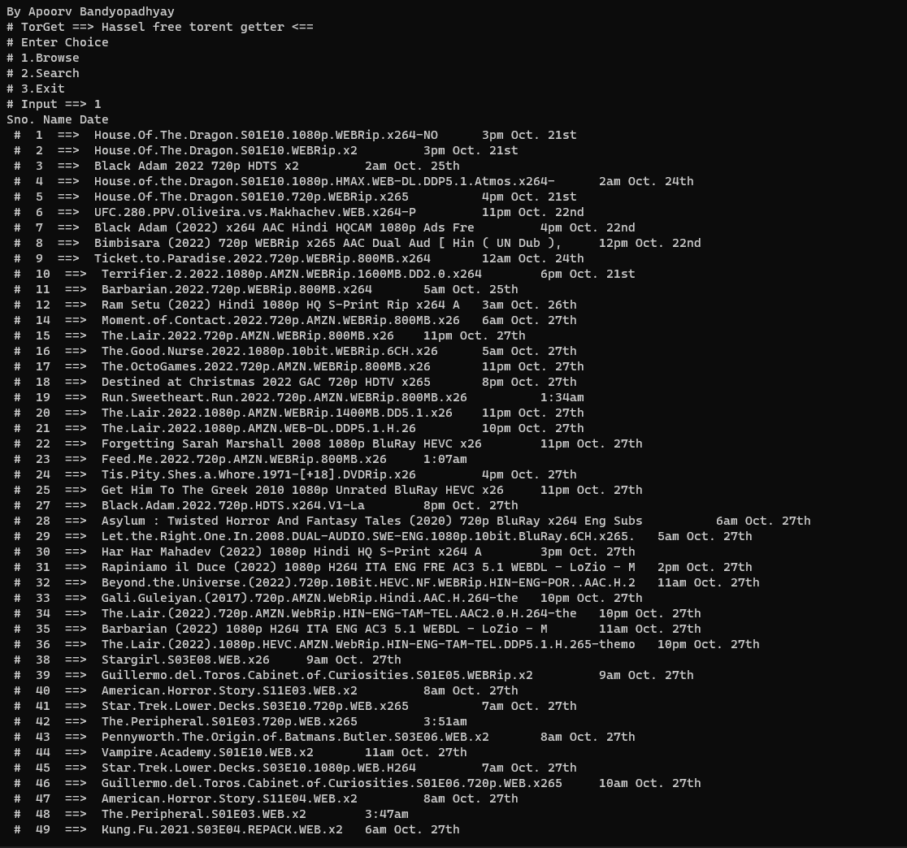
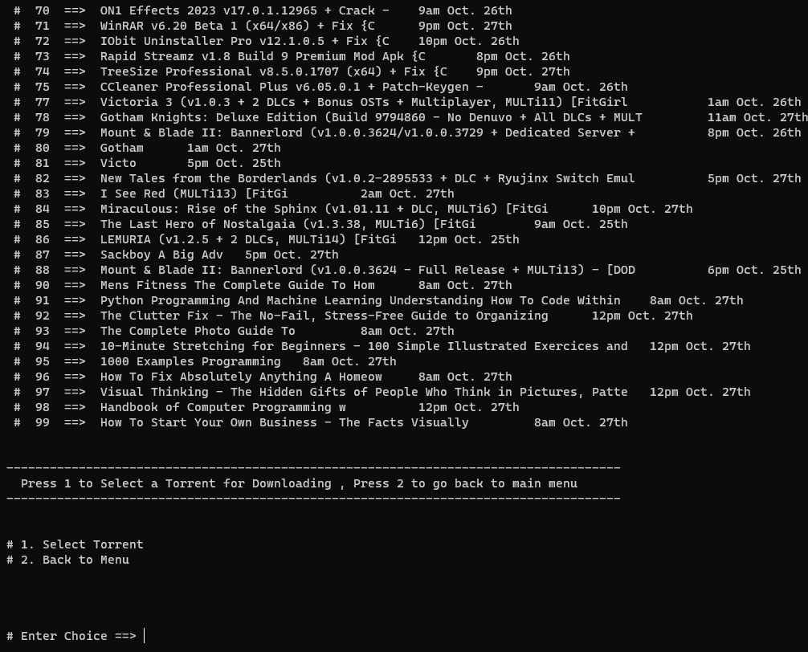
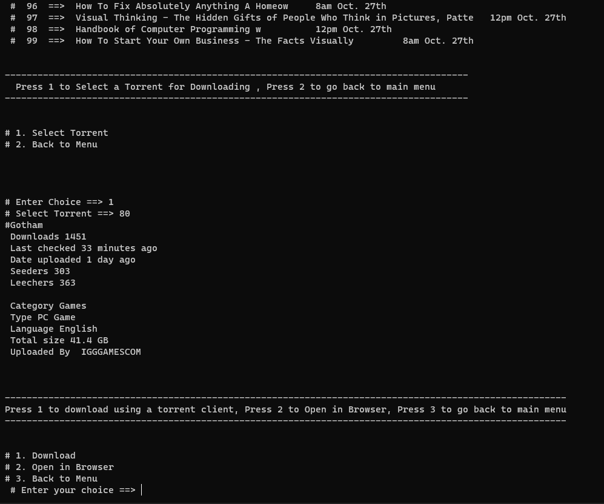
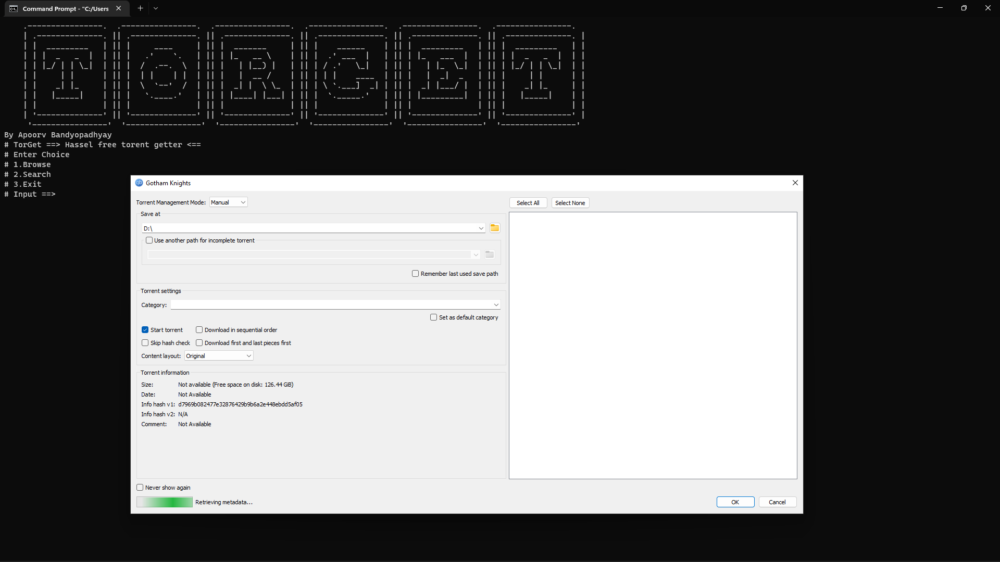
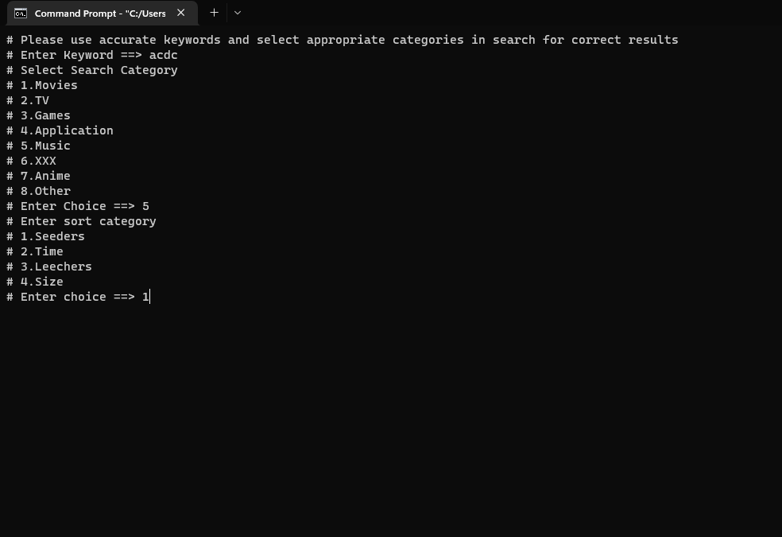
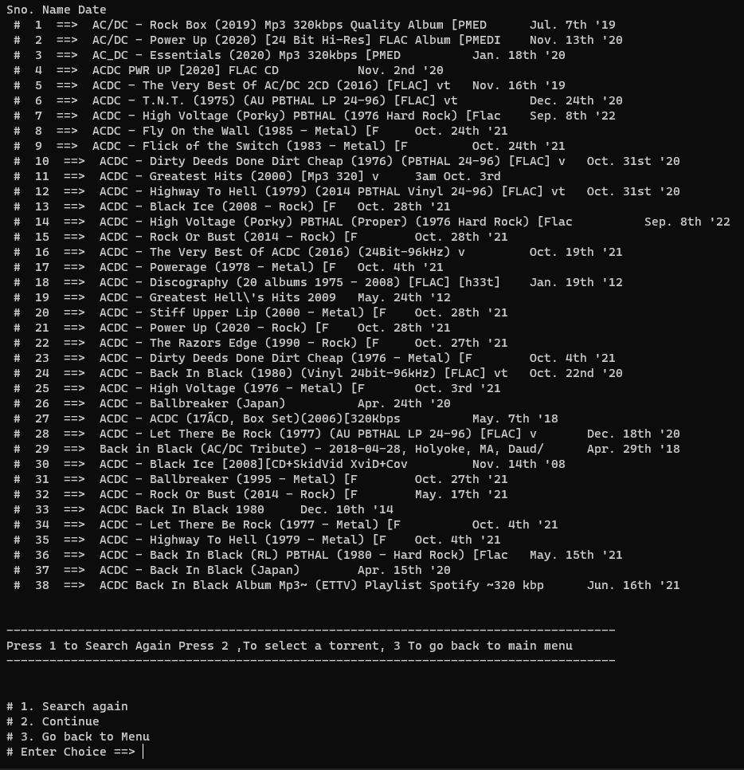

# TorGet 

A simple cli based application to get the best torrent for your favorate application without all the hassal and irritating pop ups from **https://1337x.to** 
*By Apoorv Bandyopadhyay*
Follow me on
- [Twitter](https://twitter.com/SoormaBangali)
- apoorvban2328@gmail.com

## Features
- Browse the 1337x homepage to see the list of availabe torrents 
- Select torrents from the list to download 
- Search Torrents using custom keywords
- Directly add the torrent to your client
- Search made easy using advance filters to make the results accurate 
- No **Ads** , tracking **cookies** , irritating **popups** 
- No background processes eating up extra **ram**

### Disclaimer  
- Thank you for using my project, fork and add new features and make it grow, I will merge if your features are exciting with the main branch and include it in the next release with proper credits

## Requirements
- This script does not download torrents only search for them
- A torrent client is needed to download torrents tested with [qbit torrent](https://www.qbittorrent.org/download.php) 
- Developed on Python 3.10.8 
- There is no **DNS** or **VPN** included in the script [1337x.to](https://1337x.to/home) works  on your internet connection.

## Release
### v1.0
- First release containing a simple browse option to fetch the homepage of [1337x.to](https://1337x.to/home)
- A search option to get torrents using custom keywords (*keywords needs to be accurate and the selections of parameters too to get the best result*)
- Magnet Download - After selecting the desired torrent people can directly add the magnet link to your torrent client.

### Bugs 
- There is one known bug that I am working on is if the torrent name has charecters that are not supported on terminal the script crashes currently i have a temporary solution not to print the full name of torrents but this will be fixed soon.

#### Windows 
- .exe included inside the build folder created using *Setup.py* to directly run the app without having python installed on your system.
- If you have python installed will recommend running using powershell or cmd using `python torget.py`

### Linux
- run the *torget.py* script using the **Bash Shell** using `python torget.py`
- tested on debian linux i.e mint/ubuntu/kali make sure you python installed and a torrent client

### Mac
- Should run easily in mac if python is installed by executing in the terminal *Not Tested*

##Screenshots

